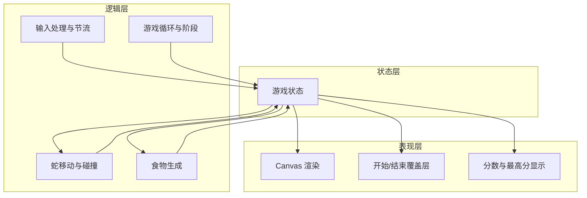
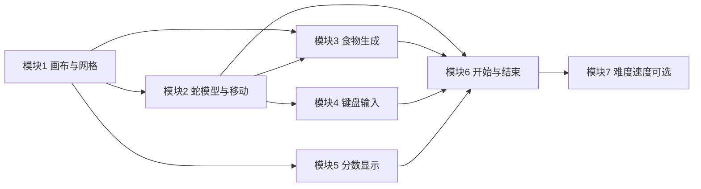

# 纯 Web HTML5 贪吃蛇 - 架构设计与开发计划

## 一、技术选型（约束与选择）

需求已明确技术边界，选型如下：

| 类别 | 选型 | 说明 |
|------|------|------|
| 标记与样式 | HTML5 + CSS3 | 单页结构，画布外 UI 用 HTML/CSS |
| 逻辑与绘制 | 原生 JavaScript (ES5+) | 无 Node、无打包、无框架 |
| 渲染 | Canvas 2D API | 游戏区域绘制，格子为整数像素 |
| 持久化（可选） | localStorage | 仅用于历史最高分 |
| 运行环境 | 现代浏览器 | Chrome / Firefox / Edge / Safari |

不引入：Node.js、Webpack/Vite 等打包工具、React/Vue 等框架、任何第三方 JS 库。

---

## 二、架构设计

### 2.1 分层结构（满足 NFR-2）

- **状态层**：集中维护「游戏阶段、蛇身队列、方向、食物坐标、当前分、最高分、是否暂停」等；逻辑与渲染只读/写此状态。
- **逻辑层**：游戏循环（requestAnimationFrame 或 setInterval）、蛇的移动与碰撞、食物生成、键盘输入解析与节流、禁止反向。
- **表现层**：Canvas 2D 绘制网格内蛇与食物；画布外或覆盖层显示分数、开始提示、结束与「再玩一次」。

### 2.2 数据流与游戏循环

- **输入** → 更新「下一方向」或「开始/再玩一次/暂停」意图。
- **游戏循环**（仅在进行中且未暂停时）：按当前速度 tick → 移动蛇 → 碰撞检测（墙/自身）→ 若撞则结束；否则检测是否吃食物 → 若吃则加分、去尾逻辑取消、生成新食物；否则去尾 → 写回状态。
- **每帧或每次状态变更**：用当前状态重绘 Canvas 与 UI。

### 2.3 文件与职责划分（建议）

| 文件 | 职责 |
|------|------|
| `index.html` | 页面结构：canvas、分数区、开始/结束覆盖层容器 |
| `style.css` | 布局、覆盖层、按钮样式，与画布尺寸相关样式 |
| `js/config.js` | 格子行列数、画布像素尺寸、初始速度、分数规则等可配置常量 |
| `js/state.js` | 游戏状态对象与重置函数 |
| `js/snake.js` | 蛇的数据结构、移动、碰撞检测（墙/自身） |
| `js/food.js` | 食物生成（随机且不与蛇重叠） |
| `js/input.js` | 键盘事件、方向映射、禁止反向、节流/状态锁 |
| `js/render.js` | Canvas 绘制蛇、食物、可选网格线 |
| `js/game.js` | 游戏循环、阶段切换、开始/结束/再玩一次、调用 state/snake/food/render |

若希望更少文件，可将 `snake`/`food`/`state` 合并为一个 `js/logic.js`，`input` 与 `game` 合并为 `js/game.js`，但需保持「状态 / 逻辑 / 渲染」分层清晰。

---

## 三、功能模块拆分与开发细节

### 模块 1：画布与网格（对应 FR-1）

- **配置**：在 `config.js` 中定义 `COLS`、`ROWS`（如 20×20）、`CELL_SIZE` 或直接 `CANVAS_WIDTH`/`CANVAS_HEIGHT`，保证 `CELL_SIZE = CANVAS_WIDTH / COLS` 为整数。
- **初始化**：在 `game.js` 或单独 init 中获取 canvas、2D 上下文，按配置设置 `canvas.width`/`height`（像素）。
- **坐标系统**：统一使用格子坐标 `(col, row)`，`0 ≤ col < COLS`，`0 ≤ row < ROWS`；在 `render.js` 中转换为像素时用 `col * CELL_SIZE`、`row * CELL_SIZE`，避免错位。
- **验收**：画布可正确按格子数绘制；蛇与食物后续将基于该坐标系。

### 模块 2：蛇的模型与移动（对应 FR-2）

- **数据结构**：蛇用数组表示身体，每项为 `{ col, row }`；首元素为蛇头，末元素为蛇尾。
- **初始状态**：在 `state.js` 中定义初始蛇身（如居中、向右的 3 节）、初始方向 `direction`（如 `'right'`）。
- **移动**：根据当前方向计算新蛇头 `(col, row)`；若本帧吃食物则 `body.unshift(新头)` 不 `pop()`；否则 `unshift(新头)` 且 `pop()`。
- **碰撞**：在新蛇头加入前/后检测（1）是否越界（墙）；（2）是否与自身任意一节重合。任一处成立则触发游戏结束。
- **渲染**：在 `render.js` 中遍历蛇身，在对应格子画矩形/圆角矩形；蛇头用不同颜色或描边区分。
- **验收**：蛇能按固定间隔移动、转向正确、吃食物变长、撞墙/撞身结束。

### 模块 3：食物生成（对应 FR-3）

- **可用格子**：遍历所有 `(col, row)`，排除与蛇身（含头）重合的格子，得到可选列表。
- **随机选择**：若列表非空，随机取一格作为新食物位置并写入状态；若为空（蛇已铺满）可视为胜利/平局，可选实现。
- **时机**：游戏开始生成第一个食物；每次蛇吃下食物后生成下一个。
- **渲染**：在 `render.js` 中在食物坐标画矩形/圆，可与蛇视觉区分。
- **验收**：食物从不与蛇重叠；吃后在新位置生成。

### 模块 4：键盘输入（对应 FR-4、5.2）

- **按键映射**：方向键与 W/A/S/D 映射到上下左右（如 `ArrowUp`/`W` → 上）；空格/Enter 映射为开始或再玩一次（根据当前阶段）。
- **禁止反向**：维护「当前方向」，仅当新方向与当前不相反时更新（左↔右、上↔下 为相反）。
- **节流/状态锁**：一帧内只接受一次方向变更（如用「待处理方向」在游戏 tick 时应用并清空），避免单键多转。
- **可选**：P 键切换暂停状态（仅在进行中有效）。
- **验收**：四向正确、不能反向、无单键多转；开始/再玩一次/暂停符合 5.2。

### 模块 5：分数与最高分（对应 FR-5、可选扩展）

- **当前分**：在状态中维护 `score`；每吃一食物按配置增加（如 +10）。
- **显示**：在画布外（如上方或侧边）用 HTML 元素显示当前局分数。
- **可选**：用 `localStorage` 存历史最高分；每局结束若当前分 > 最高分则更新并写入；页面加载时读取并显示。
- **验收**：分数随吃食物增加；可选最高分持久化且正确显示。

### 模块 6：开始与结束界面（对应 FR-6、5.3）

- **阶段**：状态中维护 `phase`：`'idle'` | `'playing'` | `'over'`（可选 `'paused'`）。
- **idle**：显示覆盖层「开始游戏」或「按某键开始」；监听开始键进入 `playing`（初始化蛇、食物、分数、方向，启动游戏循环）。
- **over**：显示「游戏结束」+ 本局分数 +「再玩一次」按钮或按键说明；再玩一次时重置状态并回到 `playing` 的初始状态，等同于重新开始。
- **重置内容**：蛇身与方向、食物位置、当前分恢复为初始；最高分保留。
- **验收**：流程符合 5.3；再玩一次后状态完全重置。

### 模块 7：难度与速度（可选，对应 FR-7）

- **实现方式**：在 `config.js` 中定义基础间隔（如 150ms）及可选档位或「每 N 分缩短间隔」规则；游戏循环使用当前间隔的 `setInterval` 或基于时间的 tick。
- **可选**：难度选择在开始前选择，或随分数自动提升；需在状态中保存当前速度/档位。
- **验收**：速度可配置或随分数变化，无需求可不实现。

---

## 四、开发编排与依赖

建议实施顺序：

1. **阶段 1**：配置与画布（模块 1）→ 状态与蛇（模块 2）→ 食物（模块 3）。完成「静止画面」：蛇与食物能正确绘制在网格上。
2. **阶段 2**：输入（模块 4）→ 游戏循环与移动、碰撞、吃食物（在 `game.js` 中串联模块 2、3）。完成「可玩一局」。
3. **阶段 3**：分数（模块 5）→ 开始/结束界面与再玩一次（模块 6）。完成完整流程与 NFR。
4. **阶段 4**：可选模块 7、暂停、localStorage 最高分、音效等（按需）。

---

## 五、交付物与 plan.md

- 将上述「技术选型、架构设计、模块拆分与开发细节、开发编排」整理进项目根目录的 **`plan.md`** 文件中，便于按模块实现与验收。
- 实现时保持：核心逻辑与绘制分离（NFR-2）、关键逻辑有注释（NFR-3）、仅用 HTML5/CSS3/ES5+/Canvas 2D（NFR-1）。
